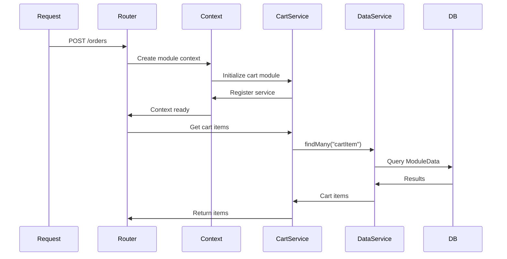

# Module Communication System - Implementation Complete

## Overview

The secure module communication system has been fully implemented, enabling modules to:
- Access data through a secure, scoped `UniversalDataService` 
- Expose typed service APIs for inter-module communication
- Initialize in order to manage dependencies
- Store data without database migrations using the schemaless ModuleData table

## What Was Implemented

### 1. Database Schema

The `ModuleData` model includes:
- `entityType` - identifies entity kind (e.g., "cart", "cartItem")
- `entityId` - module-defined unique identifier
- Unique constraint on `[moduleId, entityType, entityId]`
- Performance indexes for fast queries
- Cascade delete for data cleanup

### 2. Universal Data Service

**File:** `packages/runtime/src/universal-data-service.ts`

Provides secure, scoped data access:
- `upsert(entityType, entityId, data)` - Create or update entity
- `get(entityType, entityId)` - Retrieve entity
- `findMany(entityType, options)` - Query entities
- `delete(entityType, entityId)` - Remove entity
- `count(entityType, where)` - Count entities
- `upsertMany(entities)` - Batch operations

**Security:**
- Automatically scoped to module + store
- No access to other modules' data
- No direct Prisma access

### 3. Module Service System

**File:** `packages/core/src/types/module-service.ts`

Enables inter-module communication:
- `ModuleService` interface - base for service APIs
- `ServiceRegistry` - manages service registration

Modules can:
- Expose typed service APIs
- Call other modules' services
- Check if dependencies are available

### 4. Updated Module System

**Files:**
- `packages/core/src/types/module.ts` - Added `init` function with service support
- `packages/core/src/types/context.ts` - New context structure
- `packages/core/src/router/create-module-context.ts` - Sequential module initialization

**Key Changes:**
- Modules initialize in config.json order
- Each module gets its own scoped `UniversalDataService`
- Services registered during init are available to later modules
- Context no longer exposes raw Prisma client

### 5. Cart Module Refactored

**New Files:**
- `modules/cart/src/service.ts` - Public API types
- `modules/cart/src/service-impl.ts` - Service implementation

**Updated Files:**
- `modules/cart/src/index.ts` - Added init function
- `modules/cart/src/adapter.ts` - Fixed type compatibility

**Exported Service API:**
```typescript
interface CartService {
  getOrCreateCart(params): Promise<Cart>
  getCartItems(cartId): Promise<CartItem[]>
  getCartTotal(cartId): Promise<number>
  isProductInActiveCart(productId): Promise<boolean>
  addItem(params): Promise<CartItem>
  updateItem(itemId, quantity): Promise<CartItem>
  removeItem(itemId): Promise<void>
  clearCart(cartId): Promise<void>
}
```

## Usage Examples

### Using Cart Service from Another Module

```typescript
// modules/orders/src/store/endpoints/create-order.ts
import { createEndpoint } from "better-call";
import { z } from "zod";
import type { ModuleContext } from "@86d-app/core/types/context";
import type { CartService } from "@86d-app/cart";

export const createOrder = createEndpoint(
  "/orders",
  {
    method: "POST",
    body: z.object({
      cartId: z.string(),
    }),
  },
  async (ctx) => {
    const { body } = ctx;
    const context = ctx.context as ModuleContext;
    
    // Get cart service
    const cartService = context.services.get<CartService>("cart");
    
    if (!cartService) {
      throw new Error("Cart module is required");
    }
    
    // Use cart service
    const items = await cartService.getCartItems(body.cartId);
    const total = await cartService.getCartTotal(body.cartId);
    
    // Create order using data service
    const orderId = crypto.randomUUID();
    await context.data.upsert("order", orderId, {
      id: orderId,
      cartId: body.cartId,
      total,
      status: "pending",
      createdAt: new Date(),
    });
    
    return { orderId, total };
  }
);
```

### Creating a New Module with Service

```typescript
// modules/products/src/index.ts
import type { Module } from "@86d-app/core/types/module";
import type { ModuleContext } from "@86d-app/core/types/context";
import { createProductService } from "./service-impl";

export default function products(): Module {
  return {
    id: "products",
    
    init: async (ctx: ModuleContext) => {
      // Create and register service
      const service = createProductService(ctx.data);
      
      return {
        service,
      };
    },
    
    endpoints: {
      store: {
        "/products": listProducts,
        "/products/:id": getProduct,
      },
      admin: {
        "/admin/products": adminListProducts,
        "/admin/products/:id": adminUpdateProduct,
      },
    },
  };
}
```

### Using Data Service

```typescript
// modules/products/src/service-impl.ts
import type { UniversalDataService } from "@86d-app/core/data/universal-data-service";
import type { ProductService } from "./service";

export function createProductService(data: UniversalDataService): ProductService {
  return {
    id: "products",
    version: "1.0.0",
    
    async getProduct(productId: string) {
      return await data.get("product", productId);
    },
    
    async listProducts(options) {
      return await data.findMany("product", {
        limit: options.limit,
        offset: options.offset,
      });
    },
    
    async createProduct(product) {
      await data.upsert("product", product.id, product);
      return product;
    },
  };
}
```

## Module Configuration

Modules are initialized in the order specified in `templates/brisa/config.json`:

```json
{
  "modules": [
    "@86d-app/products",  // 1st - no dependencies
    "@86d-app/cart",      // 2nd - can use products
    "@86d-app/orders"     // 3rd - can use cart + products
  ]
}
```

**Important:** Later modules can access earlier modules' services, but not vice versa.

## Data Flow



## Security Model

### Three Layers

1. **Installation Control** - Modules must be explicitly installed
2. **Configuration Control** - Modules must be enabled in config.json
3. **Runtime Protection** - Data service scoped to module + store

### Data Isolation

```typescript
// Each module only sees its own data
const cartData = new UniversalDataService({
  db,
  storeId: "store_abc",
  moduleId: "cart",  // Can only access cart's data
});

// Trying to access another module's data won't work
await cartData.get("product", "123");  // Returns null (not cart's data)
```

## Benefits

✅ **Zero Migrations** - Add unlimited modules without schema changes  
✅ **Secure** - Modules can't access other modules' data  
✅ **Type-Safe** - Full TypeScript support for services  
✅ **Composable** - Modules can build on each other  
✅ **Flexible** - JSONB supports any data structure  
✅ **Performant** - Indexed queries with optional caching  

## Next Steps

### 1. Run Migration

```bash
cd packages/db
pnpm prisma migrate dev --name enhance_module_data
```

### 2. Regenerate Generated Files

```bash
cd apps/store
pnpm generate:modules
```

### 3. Test the System

```bash
# Start dev server
pnpm dev:store

# Test cart endpoint
curl http://localhost:3000/api/cart/get
```

### 4. Create Additional Modules

Follow the cart module as a reference implementation:
- Define service interface
- Implement service using UniversalDataService
- Add init function to register service
- Export service types for other modules

## Troubleshooting

### Module service not found

**Problem:** `context.services.get("cart")` returns undefined

**Solutions:**
1. Check module is in `templates/brisa/config.json`
2. Ensure module is listed before the one using it
3. Verify module has `init` function that returns `service`

### Data not persisting

**Problem:** Data disappears after restart

**Solutions:**
1. Run the Prisma migration
2. Check `entityType` and `entityId` are unique
3. Verify using `upsert` not just creating in-memory

### TypeScript errors

**Problem:** Type errors when using services

**Solutions:**
1. Import service type: `import type { CartService } from "@86d-app/cart"`
2. Type the context: `const context = ctx.context as ModuleContext`
3. Type the service: `context.services.get<CartService>("cart")`

## Key Files

### Packages
- `packages/core/src/types/module-service.ts` — Service interface and registry
- `packages/core/src/types/module.ts` — Module type with init support
- `packages/core/src/types/context.ts` — Module context structure
- `packages/runtime/src/universal-data-service.ts` — Secure data access layer

### Cart Module (reference implementation)
- `modules/cart/src/service.ts` — Public API types
- `modules/cart/src/service-impl.ts` — Service implementation
- `modules/cart/src/index.ts` — Module factory with init
- `modules/cart/src/adapter.ts` — Data adapter
